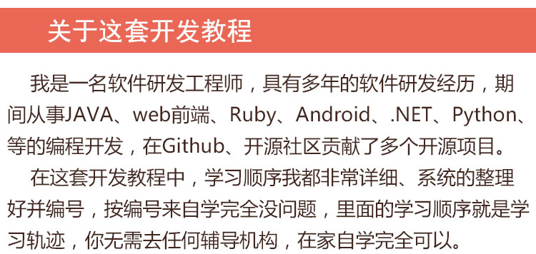
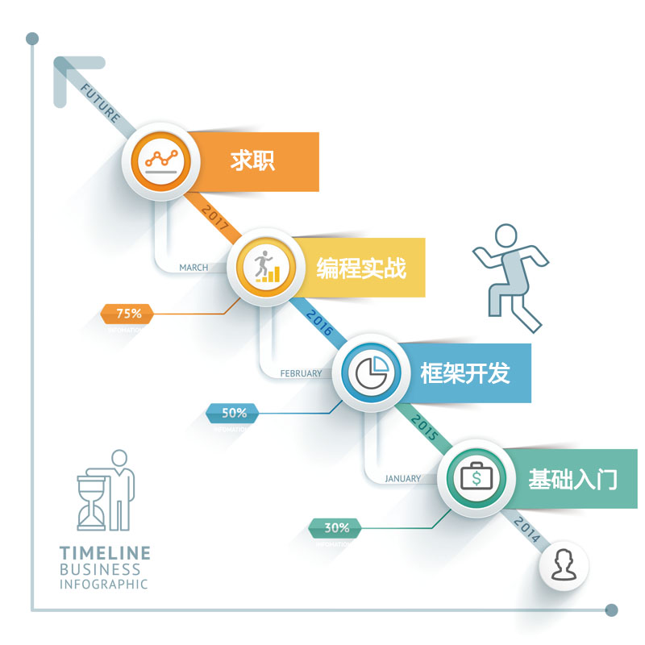

# 全套最新Java视频教程
    
     
## 001Java基础到高级视频教程--31G--[目录大纲](001Java基础到高级.md)

> 网盘地址: 链接：https://pan.baidu.com/s/1e0VtYbrWJxm7wi4OYcrafw 提取码：5qxx

## 002JDBC视频教程--3.2G--[目录大纲](002JDBC.md)

> 网盘地址: 链接：https://pan.baidu.com/s/1gbwxprYS0vRFVe\_lWuBP6A 提取码：ot7i

## 003JavaWeb开发视频教程--3.5G--[目录大纲](003JavaWeb开发.md)

> 网盘地址: 链接：https://pan.baidu.com/s/1-5ZT3yZpsqyBU3ljOB3C1g 提取码：rige

## 004JavaWEB购书系统视频教程--745M--[目录大纲](004JavaWEB购书系统.md)

> 网盘地址: 链接：https://pan.baidu.com/s/1hZ8Pso7WrA9cWBYW7kaJmw 提取码：1xls

## 005Spring视频教程--3.5G--[目录大纲](005Spring.md)

> 网盘地址: 链接：https://pan.baidu.com/s/1DoScRwFFxszj6VyRs3vKTw 提取码：1ep1

## 006SpringMVC视频教程--2.6G--[目录大纲](006SpringMVC.md)

> 网盘地址: 链接：https://pan.baidu.com/s/1LbKIui6W2sRZ3Kt-2RsZPw 提取码：nvre

## 007Mybatis视频教程--4.3G--[目录大纲](007Mybatis.md)

> 网盘地址: 链接：https://pan.baidu.com/s/1wOLebxjFyY70kzCzHU2sqw 提取码：wo9s

## 008-1MyBatisPlus视频教程--2.2G--[目录大纲](008-1MyBatisPlus.md)

> 网盘地址: 链接：https://pan.baidu.com/s/197iGhbi65A5yxGjfayZbCg 提取码：93rh

## 008-2通用Mapper视频教程--1.3G--[目录大纲](008-2通用Mapper.md)

> 网盘地址: 链接：https://pan.baidu.com/s/11TVyVHgyinOntT44eM9-eg 提取码：i05y

## 009Maven视频教程--2.0G--[目录大纲](009Maven.md)

> 网盘地址: 链接：https://pan.baidu.com/s/1aRD3QuH3eD8Cy2h8ni-HWA 提取码：38f1

## 010-1JPA视频教程--1.1G--[目录大纲](010-1JPA.md)

> 网盘地址: 链接：https://pan.baidu.com/s/1Tq0gRsl6GYzEadIiFnAwkw 提取码：an1l

## 010-2Spring分页整合视频教程--692M--[目录大纲](010-2Spring分页整合.md)

> 网盘地址: 链接：https://pan.baidu.com/s/1k8P5UoEoCoom0dacaGuhjA 提取码：sq11

## 010-3SSM整合项目视频教程--2.2G--[目录大纲](010-3SSM整合项目.md)

> 网盘地址: 链接：https://pan.baidu.com/s/188ko\_C6cWltDNhBs6cw4Yw 提取码：3vnt

## 011Struts2视频教程--1.6G--[目录大纲](011Struts2.md)

> 网盘地址: 链接：https://pan.baidu.com/s/1lZKlh\_2uOnf89NUnZpnjNw 提取码：ib7b

## 012Hibernate视频教程--973M--[目录大纲](012Hibernate.md)

> 网盘地址: 链接：https://pan.baidu.com/s/1obhyn4kNulwQ6-vgTurg9Q 提取码：uasu

## 013SSH整合项目视频教程--260M--[目录大纲](013SSH整合项目.md)

> 网盘地址: 链接：https://pan.baidu.com/s/1H0Wj48TccTrcPf72XP0l3g 提取码：ncp3

## 014SpringData视频教程--497M--[目录大纲](014SpringData.md)

> 网盘地址: 链接：https://pan.baidu.com/s/1biIcuSYJ3Ja-VPHykhF3ug 提取码：cc7e

## 015SpringCloud视频教程--5.8G--[目录大纲](015SpringCloud.md)

> 网盘地址: 链接：https://pan.baidu.com/s/1sdyQO7KPxpadeh0wWXlRjw 提取码：4m78

## 016SpringBoot视频教程--7.3G--[目录大纲](016SpringBoot.md)

> 网盘地址: 链接：https://pan.baidu.com/s/19pjkoGNEBsuGsudd6gTSMw 提取码：c71p

## 017SpringBoot整合视频教程--2.7G--[目录大纲](017SpringBoot整合.md)

> 网盘地址: 链接：https://pan.baidu.com/s/16Mtye704zaQcTJpgdDArQw 提取码：2h6u

## 018-1权限管理框架Shiro视频教程--954M--[目录大纲](018-1权限管理框架Shiro.md)

> 网盘地址: 链接：https://pan.baidu.com/s/1AhysDeKBhULgBeWxdWkMSA 提取码：frwr

## 018-2权限管理框架RBAC视频教程--4.9G--[目录大纲](018-2权限管理框架RBAC.md)

> 网盘地址: 链接：https://pan.baidu.com/s/13NitekpvMLGl0Yr5BNEtCg 提取码：3nzq

## 019IDEA视频教程--4.1G--[目录大纲](019IDEA.md)

> 网盘地址: 链接：https://pan.baidu.com/s/1nv9Cy5eweYtezxjhseJfHQ 提取码：cefv

## 020Java设计模式视频教程--3.9G--[目录大纲](020Java设计模式.md)

> 网盘地址: 链接：https://pan.baidu.com/s/1xlsTKB5mpsHgsquG1apcIQ 提取码：2tlg

## 022Jenkins视频教程--811M--[目录大纲](022Jenkins.md)

> 网盘地址: 链接：https://pan.baidu.com/s/16lNRJzzGYf92OQrKaDiA7w 提取码：l6m3

## 023Dubbo视频教程--1.7G--[目录大纲](023Dubbo.md)

> 网盘地址: 链接：https://pan.baidu.com/s/148Uj4l6zH828eVraLh9gsQ 提取码：dm3z

